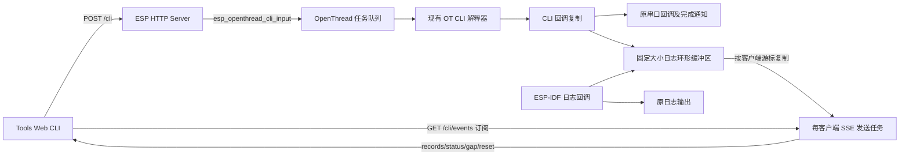

# WebUI 设计与 Web CLI

项目的 WebUI 是 ESP HTTP Server + SPIFFS 静态页面 + 原生 JavaScript。此次在 **Management → Tools** 增加 Web CLI，可读取 BR 日志并发送 `ot` 命令。

## 使用

启用 `CONFIG_OPENTHREAD_BR_START_WEB=y` 后，在 `idf.py menuconfig` → `Component config` → `ESP Thread Border Router Web` 中开启 `Enable Web CLI and BR log capture`。执行命令还需要 `CONFIG_OPENTHREAD_CLI=y`。重新编译并同时刷入应用和 `web_storage` 分区，浏览器刷新 `/tools.html` 后使用。仅更新应用的 OTA 不会更新 SPIFFS 页面。

Web CLI 默认关闭，可在项目的 `sdkconfig.defaults` 中配置：

```ini
CONFIG_OPENTHREAD_BR_START_WEB=y
CONFIG_OPENTHREAD_CLI=y
CONFIG_ESP_BR_WEB_CLI=y
CONFIG_ESP_BR_WEB_CLI_BUFFER_SIZE=16384
```

已有 `sdkconfig` 的项目请用 menuconfig 调整实际配置；defaults 不会覆盖已有值。

缓存改为按字节配置，范围 1–64 KiB，默认 16 KiB。`CONFIG_ESP_BR_WEB_CLI_BUFFER_SIZE` 就是预分配字节数组的大小；此外还有少量环形缓冲管理状态。关闭 `CONFIG_ESP_BR_WEB_CLI` 时，缓存、缓存实现、日志 hook 和 CLI 链接包装均不编译／启用。

旧配置 `CONFIG_ESP_BR_WEB_CLI_RECORD_COUNT` 不再使用，重新配置时采用新的默认容量；如有自定义需求，请在 menuconfig 或项目配置中显式设置字节数。例如原先 64 条固定记录占约 17 KiB，可改为 `CONFIG_ESP_BR_WEB_CLI_BUFFER_SIZE=16384`。条数不能直接当成字节数迁移。

每条记录保存 12 字节记录头（序号、文本长度、来源、保留字节），紧跟实际文本，不存结构体对齐填充或字符串结束符。例如 2 字节换行占 14 字节，255 字节片段占 267 字节。默认 16 KiB 在仅包含这两种片段时分别可容纳 1170 条或 61 条；实际容量随文本长度变化。

网页通过 SSE 接收输出，每批最多 16 个片段，原始文本最多约 4 KiB。缓存仍为一个共享字节数组，不为客户端复制。最多允许 2 个 SSE 客户端，每个连接创建一个 4096 字节栈的发送任务，另有任务控制块、HTTP 异步请求副本、TCP 缓冲及 cJSON 临时分配；两客户端仅任务栈就增加 8 KiB，实际内存峰值需上板测量。客户端断开／发送失败后释放请求和任务。无客户端时没有 SSE 任务。旧 GET JSON 接口保留供调试工具使用，网页不再轮询。

关闭后 `/cli` 和 `/cli/events` 路由不注册；页面从小型 `/web/features` 接口读取编译功能，隐藏 CLI 且不建立 SSE 连接。共享 SPIFFS 内仍保留静态 HTML／JS，这占用 Flash，不会保留设备端的日志环形缓冲。

输入 `ot state`、`ot ipaddr` 或 `ot help`，按 Enter 发送；也支持省略 `ot` 前缀。等待 `Done` / `Error` 后再发送下一条。方向键浏览最近 50 条命令，BR LOG 开关隐藏／显示日志，Pause 暂停读取，Clear 只清除当前页面显示。

Thread 为 disabled / detached 时仍可操作 CLI；Ping 单独根据连接状态禁用。HTTP 管理网络必须可达；改变 Wi-Fi、重启或恢复出厂配置可能使页面断线。

现有 HTTP 服务没有认证或 TLS，新增接口沿用这一访问边界。可访问管理地址的客户端能够查看日志并执行具有设备权限的 OT 命令，因此该服务应仅在受信任的管理网络使用。JSON 内容类型限制不能替代认证。

## 原有设计

| 层 | 文件 | 职责 |
|---|---|---|
| 页面 | `components/esp_ot_br_server/frontend/*.html` | Dashboard、Network、Commissioner、Addresses、Tools、Topology、About 等独立页面 |
| 公共前端 | `frontend/static/api.js`、`style.css` | Fetch 封装、导航、缓存、状态提示及卡片布局；不依赖 SPA 框架 |
| HTTP 入口 | `src/esp_br_web.c` | 收到 STA／ETH IP 事件后启动服务，注册 REST 与 GUI 接口，最后注册静态资源通配路由 |
| 业务处理 | `src/esp_br_web_api.c`、`esp_br_web_base.c` | OpenThread 查询和操作、数据转换与 JSON 封装 |
| 打包 | `components/esp_ot_br_server/CMakeLists.txt` | 将 frontend 打包进 `web_storage` SPIFFS 分区，favicon 嵌入固件 |

原生 REST 接口如 `/node/state` 与面向页面的 `/ping` 等接口共存，返回结构并非完全相同。现有 Tools 只有 Ping，且原先调用 `disableManagementPage()` 整页禁用，不适合断网诊断。

## 新增数据流



`esp_br_web_cli.c` 用 `esp_log_set_vprintf()` 复制启动 Web 功能之后的常规 ESP-IDF 日志，继续调用原日志输出函数。日志回调可被多任务调用，缓冲区写入用短临界区保护，格式化、JSON 分配和 HTTP 发送都在临界区之外。

`esp_br_web_cli_ring.c` 实现无动态分配的变长记录字节环形缓冲，由调用者加锁。记录头和文本均可跨缓冲区末尾，按两段复制；空间不足时逐条覆盖最旧的完整记录，不等待客户端。读取不删除记录，各请求以各自的序号续读。读取时每次只在临界区内跳过或复制一条记录，锁外序列化和发送；若读取期间目标记录被覆盖，停止本批读取，发送任务下一轮重新定位并发送 `gap`（旧 GET 接口使用 `dropped`）。

OT 输出不经过 ESP 日志回调。因此链接时通过 `--wrap=otCliInit` 保留并转发原输出回调，同时收集 CLI 输出；没有再次初始化解释器，原扩展命令和串口 REPL 完成通知仍保留。`--wrap=otCliInputLine` 记录命令输入，识别未完成命令并提示 busy；原生 `factoryreset` 的忙时入口保留。完成状态依据 OT 的 `Done`、`Error` 和提示符输出检测，需要在 SDK 升级时检查兼容性。

HTTP POST 通过公开的 `esp_openthread_cli_input()` 复制命令并投递至 OT 任务。HTTP 不等待异步命令完成；202 仅代表入队成功。多个网页和串口共享同一个解释器及输出记录，没有独立终端会话。设备处于 busy 时，读取输出可看到未执行提示，不自动重放命令。

## 接口及资源边界

完整结构见 `components/esp_ot_br_server/src/openapi.yaml` 的 `/cli` 和 `/cli/events`。

| 接口 | 行为 |
|---|---|
| `GET /cli/events` | SSE 订阅，先状态后输出；无游标时从当前最旧记录开始 |
| `GET /cli/events?after=SESSION:SEQ` | 从上次已接收事件续读；原生重连的 `Last-Event-ID` 优先于 URL 参数 |
| `GET /cli?after=0` | 调试兼容接口：返回最近缓冲记录和 cursor、session、ready、reset、dropped、more |
| `GET /cli?after=N` | 读取 N 之后的记录；覆写时返回 dropped，重启 session 改变时浏览器从零读取 |
| `POST /cli`，JSON `{"command":"ot state"}` | 接受单条 1–255 字节命令；拒绝控制字符、无效 JSON、过大请求；不可用时返回 503 |

设备按配置的字节预算保存最近的输出，每片段文本仍至多 255 字节，超长片段标记 truncated；改成字节缓冲不会消除格式化阶段的截断。网页不再周期性发 GET，而使用一个 EventSource。发送任务每轮最多复制 16 个片段，然后让出 CPU 50 ms；空闲时只在 BR 本地检查缓存，每 10 秒发送 SSE 注释心跳。接收/发送均不发生在日志回调中，POST 及其他 Web 请求继续由 HTTP 服务任务处理。单页仍保留最多 800 个片段。暂停、隐藏或离开页面会关闭订阅；恢复时携带最后收到的事件 ID 重连。清屏不重置该 ID，BR 日志也不会被删除。

### SSE 存储、标记与发送

1. 日志／CLI 回调将 `[uint64序号 + uint16长度 + 来源 + 保留字节][实际文本]` 写入共享 byte ring；启动标识 `session` 是独立的全局随机值，不重复存在每条头部。
2. 每个客户端只维护自己的游标和读取位置；读取时短暂加锁复制一条，锁外 JSON 编码和发送。写入者只会淘汰完整旧记录，不等待客户端。
3. `records` 事件用本批最后一条的序号作为 `cursor`；SSE `id` 是 `session:cursor`。字符串形式的 session/cursor/seq 避免 JavaScript 对 64 位整数的精度损失。事件用空行结束，完整接收后浏览器才提交其 ID。成功写入 TCP 不代表浏览器已收到，断线恢复以浏览器的 ID 为准。

```text
event: records
id: 12345:102
data: {"session":"12345","cursor":"102","ready":true,"records":[{"seq":"102","source":"cli","text":"leader\r\n"}]}

```

4. `status` 在连接建立及 CLI 可用状态变化时发送；`gap` 表示未读数据已经被覆盖，游标定位到当前最旧记录之前；`reset` 表示启动标识变化或游标超出当前序号范围，同样重新定位。三种事件的 JSON 含 session/cursor/ready，不含 records，均携带新的 ID。
5. 网络暂断由 EventSource 携带 `Last-Event-ID` 重连（建议间隔 3 秒）；若因 503 等响应进入 CLOSED，前端等待 3 秒重新创建订阅。手动恢复使用 URL `after` 参数，服务器支持冒号或 `%3A`。历史超过缓存范围只能报告 gap，不能恢复丢失日志，也不自动重发命令。

### 长连接资源与退出

最多 2 个 SSE 客户端，超限返回 503；HTTP 服务仍允许 7 个 socket，为命令和普通请求留出空间。每个 SSE 客户端有独立任务，避免一个慢客户端阻塞另一个或阻塞 POST。socket 每次发送等待上限为 2 秒（不是整个事件的绝对期限）；发送失败即退出。任务每轮以非阻塞 peek 检查对端关闭，避免闲置连接一直占着名额。该实现面向当前明文 HTTP 服务，若增加 TLS 必须同时调整这种检测方式。

停止服务器时先禁止新订阅，在生命周期互斥锁下 shutdown 所有异步请求仍持有的 socket，以打断慢发送，再等待任务恰好一次 complete 请求，最后停止 HTTP server。shutdown 不直接 close fd；真正关闭交还 HTTP server，避免已释放 fd 被复用的竞态。生命周期互斥锁不用于日志写入，也不在生产者临界区中执行网络操作。此互斥锁首次启动创建并在后续服务重启时复用。

减小缓冲区、日志产生超过发送速度、长时间暂停都可能丢失较早输出。SSE 消除了网页轮询等待，但不消除 Wi-Fi 省电、网络丢包和 TCP 重传延迟。

不保存历史到 Flash，不包含初始化之前的启动日志，也不保证捕获 ROM／early log、panic、普通 `printf()` 或其他绕过 ESP 日志及 OT CLI 回调的输出。日志级别仍受固件原配置控制。显示使用 `textContent`，去除终端控制序列，设备文本不会作为 HTML 执行。

官方参考：[ESP-IDF 日志回调](https://docs.espressif.com/projects/esp-idf/en/release-v4.4/esp32/api-reference/system/log.html)、[OpenThread CLI API](https://openthread.io/reference/group/api-cli)。实际实现以本机 SDK 源码为准。
