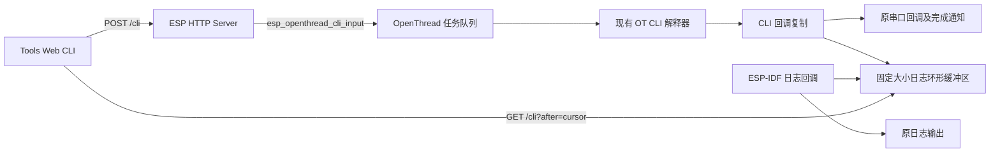

# WebUI 设计与 Web CLI

项目的 WebUI 是 ESP HTTP Server + SPIFFS 静态页面 + 原生 JavaScript。此次在 **Management → Tools** 增加 Web CLI，可读取 BR 日志并发送 `ot` 命令。

## 使用

启用 `CONFIG_OPENTHREAD_BR_START_WEB=y` 后，在 `idf.py menuconfig` → `Component config` → `ESP Thread Border Router Web` 中开启 `Enable Web CLI and BR log capture`。执行命令还需要 `CONFIG_OPENTHREAD_CLI=y`。重新编译并同时刷入应用和 `web_storage` 分区，浏览器刷新 `/tools.html` 后使用。仅更新应用的 OTA 不会更新 SPIFFS 页面。

Web CLI 默认关闭，可在项目的 `sdkconfig.defaults` 中配置：

```ini
CONFIG_OPENTHREAD_BR_START_WEB=y
CONFIG_OPENTHREAD_CLI=y
CONFIG_ESP_BR_WEB_CLI=y
CONFIG_ESP_BR_WEB_CLI_RECORD_COUNT=16
```

已有 `sdkconfig` 的项目请用 menuconfig 调整实际配置；defaults 不会覆盖已有值。

| 配置 | Web CLI 环形缓冲区常驻 RAM（ESP32-S3） |
|---|---|
| `CONFIG_ESP_BR_WEB_CLI` 关闭（默认） | 无缓冲区，后端源文件、日志 hook 和 CLI 链接包装均不编译／启用 |
| 开启，16 条 | 4,352 字节（4.25 KiB） |
| 开启，64 条（缓冲条数默认值） | 17,408 字节（17 KiB） |
| 开启，256 条（上限） | 69,632 字节（68 KiB） |

以上通过 Xtensa 编译器生成目标文件并检查符号尺寸核算，表中未计入少量全局状态、现有任务的临时栈空间及请求期间的 JSON 堆分配。单次 GET 最多包含 16 个片段，原始文本最多约 4 KiB；cJSON 节点、字符串副本、转义和序列化缓冲还会增加临时内存，实际峰值需上板测量。Web CLI 没有创建独立任务或分配独立任务栈。

关闭后 `/cli` 路由不注册；页面从小型 `/web/features` 接口读取编译功能，隐藏 CLI 且不再轮询日志。共享 SPIFFS 内仍保留静态 HTML／JS，这占用 Flash，不会保留设备端的日志环形缓冲。

输入 `ot state`、`ot ipaddr` 或 `ot help`，按 Enter 发送；也支持省略 `ot` 前缀。等待 `Done` / `Error` 后再发送下一条。方向键浏览最近 50 条命令，BR LOG 开关隐藏／显示日志，Pause 暂停读取，Clear 只清除当前页面显示。

Thread 为 disabled / detached 时仍可操作 CLI；Ping 单独根据连接状态禁用。HTTP 管理网络必须可达；改变 Wi-Fi、重启或恢复出厂配置可能使页面断线。

现有 HTTP 服务没有认证或 TLS，新增接口沿用这一访问边界。可访问管理地址的客户端能够查看日志并执行具有设备权限的 OT 命令，因此该服务应仅在受信任的管理网络使用。JSON 内容类型限制不能替代认证。

## 原有设计

| 层 | 文件 | 职责 |
|---|---|---|
| 页面 | `components/esp_ot_br_server/frontend/*.html` | Dashboard、Network、Commissioner、Addresses、Tools、Topology、About 等独立页面 |
| 公共前端 | `frontend/static/api.js`、`style.css` | Fetch 封装、导航、缓存、状态提示及卡片布局；不依赖 SPA 框架 |
| HTTP 入口 | `src/esp_br_web.c` | 收到 STA／ETH IP 事件后启动服务，注册 REST 与 GUI 接口，最后注册静态资源通配路由 |
| 业务处理 | `src/esp_br_web_api.c`、`esp_br_web_base.c` | OpenThread 查询和操作、数据转换与 JSON 封装 |
| 打包 | `components/esp_ot_br_server/CMakeLists.txt` | 将 frontend 打包进 `web_storage` SPIFFS 分区，favicon 嵌入固件 |

原生 REST 接口如 `/node/state` 与面向页面的 `/ping` 等接口共存，返回结构并非完全相同。现有 Tools 只有 Ping，且原先调用 `disableManagementPage()` 整页禁用，不适合断网诊断。

## 新增数据流



`esp_br_web_cli.c` 用 `esp_log_set_vprintf()` 复制启动 Web 功能之后的常规 ESP-IDF 日志，继续调用原日志输出函数。日志回调可被多任务调用，缓冲区写入用短临界区保护，格式化、JSON 分配和 HTTP 发送都在临界区之外。

OT 输出不经过 ESP 日志回调。因此链接时通过 `--wrap=otCliInit` 保留并转发原输出回调，同时收集 CLI 输出；没有再次初始化解释器，原扩展命令和串口 REPL 完成通知仍保留。`--wrap=otCliInputLine` 记录命令输入，识别未完成命令并提示 busy；原生 `factoryreset` 的忙时入口保留。完成状态依据 OT 的 `Done`、`Error` 和提示符输出检测，需要在 SDK 升级时检查兼容性。

HTTP POST 通过公开的 `esp_openthread_cli_input()` 复制命令并投递至 OT 任务。HTTP 不等待异步命令完成；202 仅代表入队成功。多个网页和串口共享同一个解释器及输出记录，没有独立终端会话。设备处于 busy 时，读取输出可看到未执行提示，不自动重放命令。

## 接口及资源边界

完整结构见 `components/esp_ot_br_server/src/openapi.yaml` 的 `/cli`。

| 接口 | 行为 |
|---|---|
| `GET /cli?after=0` | 返回最近缓冲记录和 cursor、session、ready、reset、dropped、more |
| `GET /cli?after=N` | 读取 N 之后的记录；覆写时返回 dropped，重启 session 改变时浏览器从零读取 |
| `POST /cli`，JSON `{"command":"ot state"}` | 接受单条 1–255 字节命令；拒绝控制字符、无效 JSON、过大请求；不可用时返回 503 |

设备保存可配置的 16–256 个片段（开启后的默认值 64），每片段文本至多 255 字节，超长片段标记 truncated。单次 GET 最多读取 16 个片段。浏览器每秒读取一次，积压时缩短至 100 ms；单页保留最多 800 个片段，隐藏页面或暂停时停止读取，失败后自动重连。记录是输出片段，不保证一个片段恰好是一行。减小缓冲区会更容易在日志密集或页面暂停时丢失较早的输出。

不保存历史到 Flash，不包含初始化之前的启动日志，也不保证捕获 ROM／early log、panic、普通 `printf()` 或其他绕过 ESP 日志及 OT CLI 回调的输出。日志级别仍受固件原配置控制。显示使用 `textContent`，去除终端控制序列，设备文本不会作为 HTML 执行。

## 验证

在仓库根目录执行 `node tools/ci/check_web_cli.js`，已覆盖文本显示／控制序列、日志过滤、命令发送、换行和 UTF-8 长度校验、历史、覆写提示、重启游标复位、断线和清屏。`node --check` 语法检查通过，OpenAPI YAML 解析通过。

已使用本机 Xtensa ESP32-S3 GCC 和 ESP-IDF v6.1 头文件，对 `esp_br_web.c` 和 `esp_br_web_cli.c` 做编译器语法／类型检查，新增后端在 CLI 启用和禁用两种配置下均通过。完整固件构建尚未通过：原构建及依赖锁引用已不存在的 v6.0.2；临时适配路径后，v6.1 的依赖解析仍因 ethernet_init 相关 Kconfig 条件无法识别而停止。这不是固件链接或设备运行验证。验证日志保留在本机 `tmp/web-cli-build/log/`，原依赖锁已恢复。

上板还需验证：串口与网页交替执行 `state`；`scan`／`ping` 的异步完成及 busy 提示；大量日志覆写；Thread 停止后的 CLI；设备重启后的重连；确认原串口可继续输入。此次未刷机。

Kconfig 改动另已完成关闭、16 条、64 条和仅日志四种配置的目标文件编译；关闭时 HTTP 入口目标文件不存在 Web CLI 后端符号引用。前端测试验证功能关闭时隐藏 CLI、不请求 `/cli`、不启动循环定时器。完整固件链接及运行内存峰值仍未验证。

官方参考：[ESP-IDF 日志回调](https://docs.espressif.com/projects/esp-idf/en/release-v4.4/esp32/api-reference/system/log.html)、[OpenThread CLI API](https://openthread.io/reference/group/api-cli)。实际实现以本机 SDK 源码为准。
